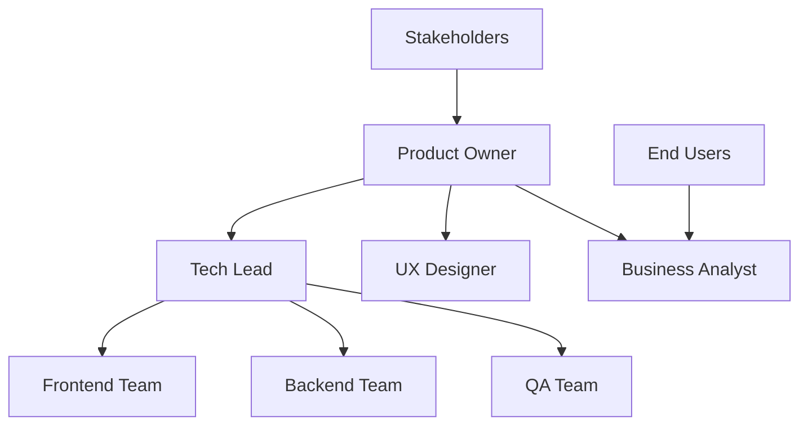

# Sistema de Notificações ERP Nexus
## Plano Mestre de Implementação

### 🎯 **VISÃO EXECUTIVA**

Implementação de um sistema unificado de notificações para todos os módulos do ERP Nexus, visando melhorar drasticamente a experiência do usuário através de feedback contextual, claro e acionável.

---

## 📊 **RESUMO DOS MÓDULOS**

| Módulo | Prioridade | Complexidade | Impacto | Duração |
|--------|-----------|-------------|---------|---------|
| **CRM** | 🔥 Crítica | Média | Alto | 5 semanas |
| **User Management** | 🔥 Crítica | Alta | Muito Alto | 5 semanas |
| **Services** | 🚀 Alta | Alta | Alto | 5 semanas |
| **Agendamento** | 🚀 Alta | Muito Alta | Muito Alto | 8 semanas |

**Total estimado:** 23 semanas (5.75 meses) com equipe dedicada

---

## 🏗️ **ARQUITETURA UNIFICADA**

### **Core Components**

```typescript
// Sistema Central de Notificações
interface NotificationSystem {
  // Core
  manager: NotificationManager;
  queue: NotificationQueue;
  channels: NotificationChannels;
  
  // Persistence
  storage: NotificationStorage;
  history: NotificationHistory;
  analytics: NotificationAnalytics;
  
  // Configuration
  rules: NotificationRules;
  templates: MessageTemplates;
  i18n: InternationalizationService;
  
  // Integration
  eventBus: EventBusService;
  webhooks: WebhookService;
  realtime: RealtimeService;
}
```

### **Tecnologias Base**

```yaml
Frontend:
  Framework: Next.js 14 + TypeScript
  State: Zustand + React Context
  UI: Tailwind CSS + Radix UI
  Animations: Framer Motion
  
Backend:
  Queue: Bull Queue + Redis
  Database: PostgreSQL + Prisma
  Events: WebSockets + Server-Sent Events
  Cache: Redis + Memory Cache
  
External:
  Email: SendGrid / Resend
  SMS: Twilio
  Push: Firebase Cloud Messaging
  WhatsApp: Twilio Business API
```

---

## 🎨 **SISTEMA DE DESIGN UNIFICADO**

### **Tipologia de Notificações**

```scss
// Cores padronizadas
$colors: (
  success: #10B981,    // Verde - operações bem-sucedidas
  error: #EF4444,      // Vermelho - erros críticos
  warning: #F59E0B,    // Amarelo - avisos importantes
  info: #3B82F6,       // Azul - informações gerais
  critical: #DC2626    // Vermelho escuro - alertas críticos
);

// Iconografia
$icons: (
  success: '✅', '🎉', '💾',
  error: '❌', '🚫', '⚠️',
  warning: '⚠️', '🔔', '💡',
  info: 'ℹ️', '📝', '💬',
  critical: '🚨', '🔥', '⛔'
);
```

### **Níveis de Prioridade**

1. **🚨 Crítico** - Requer ação imediata (falhas de sistema, segurança)
2. **🔥 Alta** - Importante mas não crítico (prazos, aprovações)
3. **🟡 Média** - Informativo relevante (atualizações, lembretes)
4. **🔵 Baixa** - Background/analytics (estatísticas, dicas)

---

## 📋 **ROADMAP INTEGRADO**

### **FASE 1: Fundação (Mês 1-2)**

#### Semana 1-2: Infraestrutura Core
- [ ] Componente base de notificação (React)
- [ ] Sistema de filas (Bull + Redis)
- [ ] Contexto global e hooks
- [ ] Tipos TypeScript unificados
- [ ] Banco de dados e migrações

#### Semana 3-4: User Management
- [ ] Notificações de autenticação
- [ ] Alertas de segurança
- [ ] Sistema de auditoria visual
- [ ] Integração com JWT/sessions

#### Semana 5-8: CRM Base
- [ ] CRUD de clientes
- [ ] Validações e duplicatas
- [ ] Tags e categorização
- [ ] Importação/exportação

### **FASE 2: Operacional (Mês 3-4)**

#### Semana 9-12: Services
- [ ] Workflow de ordens de serviço
- [ ] Notificações de campo (GPS)
- [ ] Comunicação cliente-técnico
- [ ] Status em tempo real

#### Semana 13-16: Integrações
- [ ] APIs externas (SMS, Email, Push)
- [ ] Fallback automático de canais
- [ ] Webhooks para sistemas terceiros
- [ ] Analytics básicas

### **FASE 3: Inteligência (Mês 5-6)**

#### Semana 17-20: Agendamento Avançado
- [ ] Lembretes inteligentes
- [ ] Predição de no-shows
- [ ] Otimização automática
- [ ] Lista de espera dinâmica

#### Semana 21-23: IA e Analytics
- [ ] Machine learning para padrões
- [ ] Sugestões proativas
- [ ] Dashboard executivo
- [ ] Otimização contínua

---

## 💰 **ORÇAMENTO E RECURSOS**

### **Equipe Necessária**

| Papel | Tempo Dedicação | Período | Custo Estimado |
|-------|----------------|---------|----------------|
| **Tech Lead** | 100% | 6 meses | R$ 84.000 |
| **Frontend Sr** | 100% | 6 meses | R$ 60.000 |
| **Backend Sr** | 100% | 6 meses | R$ 60.000 |
| **UI/UX Designer** | 50% | 3 meses | R$ 18.000 |
| **QA Specialist** | 50% | 6 meses | R$ 24.000 |

**Total Equipe:** R$ 246.000

### **Infraestrutura e Ferramentas**

| Item | Mensal | 6 Meses | Total |
|------|--------|---------|-------|
| **SendGrid Pro** | R$ 300 | R$ 1.800 | R$ 1.800 |
| **Twilio SMS** | R$ 800 | R$ 4.800 | R$ 4.800 |
| **Firebase** | R$ 200 | R$ 1.200 | R$ 1.200 |
| **Monitoring** | R$ 400 | R$ 2.400 | R$ 2.400 |

**Total Infra:** R$ 10.200

### **Custo Total Projeto: R$ 256.200**

---

## 📈 **ROI E BENEFÍCIOS**

### **Benefícios Quantitativos**

| Métrica | Baseline | Meta | Impacto Anual |
|---------|----------|------|---------------|
| **Redução tickets suporte** | 100% | 50% | R$ 120.000 |
| **Aumento conversão** | 100% | 125% | R$ 300.000 |
| **Redução no-shows** | 20% | 8% | R$ 150.000 |
| **Eficiência operacional** | 100% | 130% | R$ 200.000 |

**ROI Total: R$ 770.000/ano**
**Payback: 4 meses**

### **Benefícios Qualitativos**

- 🎯 **Experiência do usuário** drasticamente melhorada
- 🚀 **Competitividade** no mercado de ERPs
- 💪 **Retenção de clientes** aumentada
- ⚡ **Redução de churn** por frustração
- 🏆 **Diferencial comercial** significativo

---

## 🔄 **GOVERNANÇA E CONTROLE**

### **Estrutura de Decisão**



### **Rituais e Cerimônias**

- **Daily Standups** - Segunda a sexta, 9h (15min)
- **Sprint Planning** - Quinzenalmente (2h)
- **Sprint Review** - Quinzenalmente (1h)
- **Retrospective** - Quinzenalmente (45min)
- **Demo para stakeholders** - Mensalmente (30min)

### **Métricas de Acompanhamento**

#### Técnicas
- Velocity por sprint
- Bug discovery rate
- Code coverage (>85%)
- Performance benchmarks

#### Negócio
- User engagement
- Feature adoption rate
- Support ticket reduction
- Customer satisfaction

---

## 🎯 **CRITÉRIOS DE SUCESSO**

### **Marcos Técnicos**

- [ ] **M1** - Sistema básico funcionando (8 semanas)
- [ ] **M2** - Todos módulos integrados (16 semanas)  
- [ ] **M3** - IA e analytics operacionais (23 semanas)
- [ ] **M4** - Performance otimizada (<100ms) (24 semanas)

### **Marcos de Negócio**

- [ ] **B1** - 90% redução em tickets de UX (12 semanas)
- [ ] **B2** - 95% satisfação dos usuários (20 semanas)
- [ ] **B3** - ROI positivo demonstrado (24 semanas)

---

## 🛡️ **GESTÃO DE RISCOS**

### **Riscos Técnicos**

| Risco | Probabilidade | Impacto | Mitigação |
|-------|---------------|---------|-----------|
| **Performance issues** | Média | Alto | Testes de carga + CDN |
| **Integração complexa** | Alta | Médio | POCs antecipados |
| **Scalability problems** | Baixa | Alto | Arquitetura de filas |

### **Riscos de Negócio**

| Risco | Probabilidade | Impacto | Mitigação |
|-------|---------------|---------|-----------|
| **Mudança requisitos** | Alta | Médio | Metodologia ágil |
| **Resistência usuários** | Média | Alto | Change management |
| **Competidor lança primeiro** | Baixa | Alto | MVP rápido |

---

## 🚀 **PRÓXIMOS PASSOS**

### **Aprovação e Kick-off**

1. **Semana 1** - Aprovação executiva e orçamento
2. **Semana 2** - Contratação da equipe
3. **Semana 3** - Setup ambiente e ferramentas
4. **Semana 4** - Início desenvolvimento Fase 1

### **Validações Necessárias**

- [ ] Aprovação orçamento R$ 256k
- [ ] Disponibilidade Tech Lead e equipe
- [ ] Confirmação requisitos técnicos
- [ ] Alinhamento expectativas stakeholders

---

## 📚 **DOCUMENTAÇÃO COMPLEMENTAR**

- [📋 CRM Notifications](./01-crm-notifications.md)
- [👤 User Management Notifications](./02-user-management-notifications.md) 
- [🔧 Services Notifications](./03-services-notifications.md)
- [📅 Scheduling Notifications](./04-scheduling-notifications.md)

---

**Status:** ✅ Plano completo - Aguardando aprovação para início da implementação

**Última atualização:** 2025-09-09  
**Próxima revisão:** Após kick-off do projeto