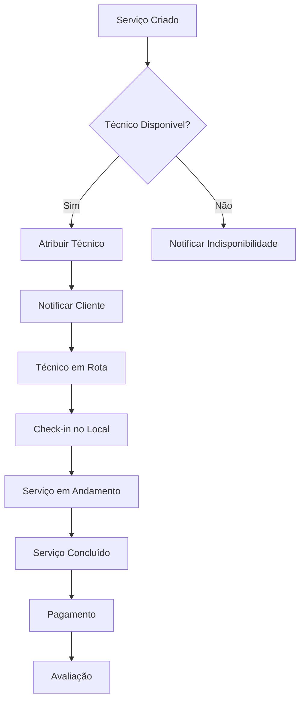

# Sistema de Notificações - Módulo Services
## Plano de Implementação Completo

### 📋 **VISÃO GERAL**

Sistema de notificações para o módulo de Serviços, focado em workflow operacional, status de serviços e comunicação com clientes.

---

## 🎯 **1. MAPEAMENTO DE CENÁRIOS**

### **1.1 Operações de Serviço**

#### **🟢 Cenários de Sucesso**
- ✅ Ordem de serviço criada
- ✅ Status atualizado (Em andamento → Concluído)
- ✅ Técnico atribuído ao serviço
- ✅ Cliente notificado automaticamente
- ✅ Relatório de serviço gerado
- ✅ Peças/materiais registrados
- ✅ Pagamento confirmado

#### **🔴 Cenários de Erro**
- ❌ Cliente não encontrado (404)
- ❌ Técnico indisponível (409)
- ❌ Horário já ocupado (409)
- ❌ Peças em falta (409)
- ❌ Localização inacessível (400)
- ❌ Falha no envio de notificação
- ❌ Erro na geração de relatório
- ❌ Pagamento recusado (402)

#### **🟡 Cenários de Aviso**
- ⚠️ Serviço atrasado
- ⚠️ Técnico próximo do local
- ⚠️ Cliente não atende contato
- ⚠️ Material insuficiente
- ⚠️ Prazo de garantia expirando
- ⚠️ Avaliação pendente

### **1.2 Gestão de Técnicos**

#### **🟢 Cenários de Sucesso**
- ✅ Check-in no local realizado
- ✅ Relatório enviado
- ✅ Rota otimizada calculada
- ✅ Disponibilidade atualizada

#### **🔴 Cenários de Erro**
- ❌ Falha no GPS/localização
- ❌ Técnico não chegou no prazo
- ❌ Equipamento danificado
- ❌ Acesso negado pelo cliente

#### **🟡 Cenários de Aviso**
- ⚠️ Técnico em trânsito
- ⚠️ Atraso estimado
- ⚠️ Condições climáticas adversas

### **1.3 Comunicação com Cliente**

#### **🟢 Cenários de Sucesso**
- ✅ Agendamento confirmado
- ✅ Lembrete enviado
- ✅ Avaliação recebida

#### **🔴 Cenários de Erro**
- ❌ Cliente não confirmou presença
- ❌ Reagendamento necessário
- ❌ Cancelamento de última hora

---

## 🎨 **2. CATÁLOGO DE MENSAGENS**

### **2.1 Operações de Serviço**

```javascript
const SERVICE_MESSAGES = {
  SERVICE_CREATED: {
    title: "Ordem de serviço criada!",
    message: "OS #{serviceId} registrada para {customerName}.",
    action: "Ver detalhes",
    icon: "🔧",
    duration: 4000,
    type: "success"
  },
  SERVICE_COMPLETED: {
    title: "Serviço concluído!",
    message: "OS #{serviceId} finalizada com sucesso.",
    suggestion: "Cliente será notificado automaticamente.",
    action: "Ver relatório",
    icon: "✅",
    duration: 5000,
    type: "success"
  },
  TECHNICIAN_ASSIGNED: {
    title: "Técnico atribuído",
    message: "{technicianName} foi designado para o serviço.",
    suggestion: "O técnico receberá as informações por email.",
    icon: "👨‍🔧",
    duration: 3000,
    type: "success"
  },
  CUSTOMER_NOT_FOUND: {
    title: "Cliente não encontrado",
    message: "Não foi possível localizar este cliente.",
    suggestion: "Verifique o cadastro no CRM ou crie um novo cliente.",
    action: "Ir para CRM",
    icon: "🔍",
    type: "error"
  },
  TECHNICIAN_UNAVAILABLE: {
    title: "Técnico indisponível",
    message: "O técnico selecionado já possui compromisso neste horário.",
    suggestion: "Escolha outro técnico ou horário disponível.",
    action: "Ver agenda",
    icon: "📅",
    type: "error"
  },
  PARTS_SHORTAGE: {
    title: "Peças em falta",
    message: "Alguns materiais não estão disponíveis em estoque.",
    suggestion: "Solicite reposição ou use peças alternativas.",
    action: "Gerenciar estoque",
    icon: "📦",
    type: "error"
  }
}
```

### **2.2 Alertas Operacionais**

```javascript
const OPERATIONAL_ALERTS = {
  SERVICE_DELAYED: {
    title: "Serviço atrasado",
    message: "OS #{serviceId} está {minutes}min atrasada.",
    suggestion: "Entre em contato com o cliente para informar.",
    action: "Ligar para cliente",
    icon: "⏰",
    type: "warning",
    priority: "high"
  },
  TECHNICIAN_NEARBY: {
    title: "Técnico chegando",
    message: "{technicianName} está a 5min do local.",
    suggestion: "Cliente será notificado automaticamente.",
    icon: "🚗",
    duration: 10000,
    type: "info"
  },
  PAYMENT_REQUIRED: {
    title: "Pagamento pendente",
    message: "Serviço concluído aguarda confirmação de pagamento.",
    action: "Processar pagamento",
    icon: "💳",
    type: "warning",
    persistent: true
  },
  WARRANTY_EXPIRING: {
    title: "Garantia expirando",
    message: "Garantia de {serviceName} expira em {days} dias.",
    suggestion: "Entre em contato com cliente para oferecer extensão.",
    action: "Ver detalhes",
    icon: "🛡️",
    type: "info"
  },
  CUSTOMER_NO_RESPONSE: {
    title: "Cliente não atende",
    message: "3 tentativas de contato sem resposta.",
    suggestion: "Tente outros meios de contato ou reagende.",
    action: "Tentar novamente",
    icon: "📞",
    type: "warning"
  }
}
```

### **2.3 Notificações de Campo**

```javascript
const FIELD_NOTIFICATIONS = {
  CHECKIN_SUCCESS: {
    title: "Check-in realizado!",
    message: "Técnico chegou ao local às {time}.",
    icon: "📍",
    duration: 3000,
    type: "success"
  },
  ROUTE_OPTIMIZED: {
    title: "Rota otimizada",
    message: "Nova rota calculada: economia de {minutes}min.",
    action: "Ver rota",
    icon: "🗺️",
    duration: 4000,
    type: "info"
  },
  WEATHER_ALERT: {
    title: "Alerta climático",
    message: "Condições adversas na região do serviço.",
    suggestion: "Considere reagendar ou tomar precauções extras.",
    action: "Ver previsão",
    icon: "🌧️",
    type: "warning"
  },
  EQUIPMENT_ISSUE: {
    title: "Problema no equipamento",
    message: "Técnico reportou falha no equipamento #{equipmentId}.",
    action: "Enviar substituto",
    icon: "⚠️",
    type: "error",
    priority: "high"
  }
}
```

---

## 🔧 **3. FUNCIONALIDADES ESPECIAIS**

### **3.1 Notificações Georreferenciadas**

```typescript
interface LocationNotification extends Notification {
  location: {
    lat: number;
    lng: number;
    address: string;
  };
  radius: number; // metros
  trigger: 'enter' | 'exit' | 'nearby';
}

const GeoNotificationService = {
  setupProximityAlert: (serviceId: string, location: Location) => {
    navigator.geolocation.watchPosition((position) => {
      const distance = calculateDistance(position.coords, location);
      
      if (distance <= 500) { // 500m de proximidade
        addNotification({
          type: 'info',
          title: 'Chegando ao local',
          message: 'Você está próximo do cliente.',
          action: { label: 'Fazer check-in', onClick: () => checkIn(serviceId) }
        });
      }
    });
  }
};
```

### **3.2 Notificações Temporais**

```typescript
const ServiceTimelineNotifications = {
  scheduleReminders: (service: Service) => {
    const reminders = [
      { when: subHours(service.scheduledTime, 24), message: 'Serviço amanhã' },
      { when: subHours(service.scheduledTime, 2), message: 'Serviço em 2h' },
      { when: subMinutes(service.scheduledTime, 30), message: 'Serviço em 30min' }
    ];
    
    reminders.forEach(reminder => {
      scheduleNotification(reminder.when, {
        title: 'Lembrete de serviço',
        message: reminder.message,
        type: 'info'
      });
    });
  }
};
```

### **3.3 Notificações de Status em Tempo Real**

```typescript
const ServiceStatusNotifications = {
  subscribeToUpdates: (serviceId: string) => {
    // WebSocket ou Server-Sent Events
    const eventSource = new EventSource(`/api/services/${serviceId}/events`);
    
    eventSource.onmessage = (event) => {
      const update = JSON.parse(event.data);
      
      switch (update.type) {
        case 'status_changed':
          addNotification({
            title: 'Status atualizado',
            message: `Serviço mudou para: ${update.newStatus}`,
            type: 'info'
          });
          break;
        case 'technician_update':
          addNotification({
            title: 'Atualização do técnico',
            message: update.message,
            type: 'info'
          });
          break;
      }
    };
  }
};
```

---

## 📱 **4. INTEGRAÇÃO COM SISTEMAS EXTERNOS**

### **4.1 Sistemas de Mapeamento**
- Google Maps/Waze para rotas
- Notificações de trânsito em tempo real
- Alertas de localização imprecisa

### **4.2 Sistemas de Pagamento**
- Confirmação de pagamento via PIX/Cartão
- Alertas de pagamento recusado
- Notificações de estorno

### **4.3 ERP/Estoque**
- Alertas de baixo estoque
- Confirmação de separação de materiais
- Notificações de pedidos de compra

### **4.4 Comunicação Externa**
- WhatsApp Business API
- SMS via Twilio
- Email transacional

---

## 🎯 **5. PRIORIZAÇÃO POR IMPACTO**

### **Crítico (Semana 1)**
1. Criação/conclusão de OS
2. Atribuição de técnicos
3. Alertas de atraso
4. Falhas de comunicação

### **Alto (Semana 2-3)**
1. Check-in/check-out de campo
2. Notificações de pagamento
3. Alertas de estoque
4. Comunicação com cliente

### **Médio (Semana 4-5)**
1. Otimização de rotas
2. Alertas climáticos
3. Lembretes automáticos
4. Analytics de performance

### **Baixo (Backlog)**
1. Gamificação para técnicos
2. Integrações avançadas
3. Relatórios personalizados
4. IA preditiva

---

## 📊 **6. MÉTRICAS ESPECÍFICAS**

### **6.1 Operacionais**
- Redução de 40% no tempo de resposta
- Aumento de 60% na pontualidade
- 95% de precisão em notificações críticas
- Redução de 50% em no-shows

### **6.2 Satisfação do Cliente**
- NPS +20 pontos
- 90% de avaliações positivas
- Redução de 70% em reclamações
- Aumento de 30% em agendamentos

---

## 🔄 **7. WORKFLOW DE NOTIFICAÇÕES**



---

**Status:** Pronto para desenvolvimento com foco na experiência operacional em campo.