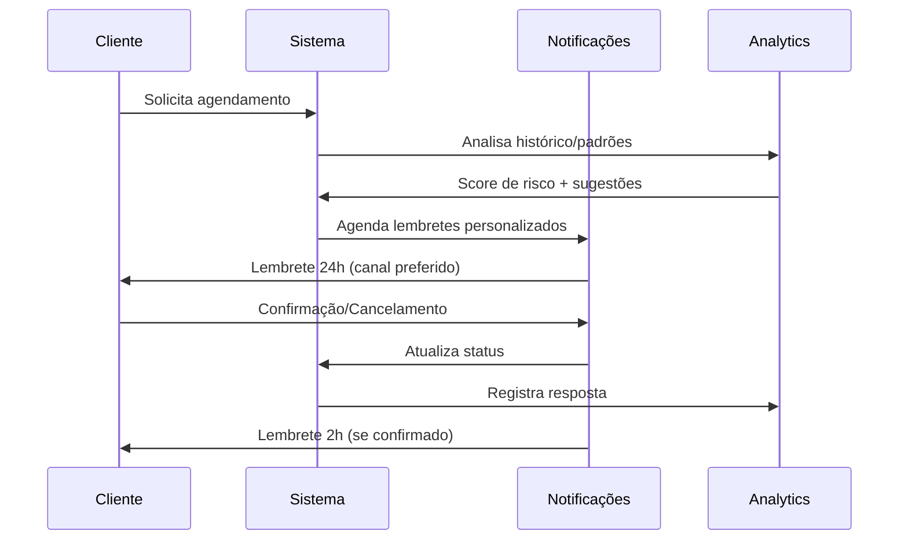

# Sistema de Notificações - Módulo Agendamento
## Plano de Implementação Completo

### 📋 **VISÃO GERAL**

Sistema de notificações para o módulo de Agendamento, focado em gestão de horários, lembretes automáticos e otimização da agenda.

---

## 🎯 **1. MAPEAMENTO DE CENÁRIOS**

### **1.1 Gestão de Agendamentos**

#### **🟢 Cenários de Sucesso**
- ✅ Agendamento criado com sucesso
- ✅ Horário confirmado pelo cliente
- ✅ Reagendamento realizado
- ✅ Cancelamento processado
- ✅ Lembrete enviado automaticamente
- ✅ Check-in realizado
- ✅ Agenda otimizada

#### **🔴 Cenários de Erro**
- ❌ Horário indisponível (409)
- ❌ Conflito de agenda (409)
- ❌ Cliente não encontrado (404)
- ❌ Horário no passado (400)
- ❌ Limite de agendamentos atingido (429)
- ❌ Falha no envio de lembrete
- ❌ Cancelamento fora do prazo (400)
- ❌ Recurso/sala indisponível (409)

#### **🟡 Cenários de Aviso**
- ⚠️ Agenda lotada no período
- ⚠️ Cliente com histórico de atrasos
- ⚠️ Horário de pico detectado
- ⚠️ Cancelamento de última hora
- ⚠️ Lista de espera disponível
- ⚠️ Confirmação pendente

### **1.2 Lembretes e Confirmações**

#### **🟢 Cenários de Sucesso**
- ✅ Lembrete 24h enviado
- ✅ Lembrete 2h enviado
- ✅ Confirmação recebida
- ✅ Cliente chegou no horário

#### **🔴 Cenários de Erro**
- ❌ Falha no envio de SMS/Email
- ❌ Cliente não confirmou presença
- ❌ No-show (cliente não compareceu)
- ❌ Chegada antecipada sem vaga

#### **🟡 Cenários de Aviso**
- ⚠️ Cliente não confirmou em 24h
- ⚠️ Alto risco de no-show
- ⚠️ Fila de espera formada

### **1.3 Otimização de Agenda**

#### **🟢 Cenários de Sucesso**
- ✅ Horários reorganizados
- ✅ Tempo ocioso reduzido
- ✅ Sugestão de horário aceita
- ✅ Bloco de atendimento criado

#### **🔴 Cenários de Erro**
- ❌ Impossível reorganizar
- ❌ Conflito de recursos
- ❌ Cliente rejeitou sugestão

#### **🟡 Cenários de Aviso**
- ⚠️ Agenda com lacunas
- ⚠️ Sobrecarga em horário específico
- ⚠️ Padrão de cancelamentos detectado

---

## 🎨 **2. CATÁLOGO DE MENSAGENS**

### **2.1 Operações de Agendamento**

```javascript
const SCHEDULING_MESSAGES = {
  APPOINTMENT_CREATED: {
    title: "Agendamento criado!",
    message: "Compromisso marcado para {date} às {time}.",
    suggestion: "Cliente receberá confirmação automaticamente.",
    action: "Ver na agenda",
    icon: "📅",
    duration: 4000,
    type: "success"
  },
  APPOINTMENT_CONFIRMED: {
    title: "Agendamento confirmado!",
    message: "{customerName} confirmou presença para {date}.",
    icon: "✅",
    duration: 3000,
    type: "success"
  },
  APPOINTMENT_RESCHEDULED: {
    title: "Reagendamento realizado",
    message: "Horário alterado de {oldDate} para {newDate}.",
    suggestion: "Cliente será notificado da mudança.",
    icon: "🔄",
    duration: 4000,
    type: "info"
  },
  TIME_CONFLICT: {
    title: "Conflito de horário",
    message: "Já existe um compromisso marcado para este horário.",
    suggestion: "Escolha outro horário ou verifique a disponibilidade.",
    action: "Ver horários livres",
    icon: "⚠️",
    type: "error"
  },
  SLOT_UNAVAILABLE: {
    title: "Horário indisponível",
    message: "O horário selecionado não está mais disponível.",
    suggestion: "Tente um dos horários sugeridos abaixo.",
    action: "Ver sugestões",
    icon: "🚫",
    type: "error"
  },
  BOOKING_LIMIT_REACHED: {
    title: "Limite de agendamentos",
    message: "Você atingiu o limite de {limit} agendamentos simultâneos.",
    suggestion: "Cancele um agendamento existente ou aguarde liberação.",
    action: "Ver minha agenda",
    icon: "📊",
    type: "error"
  }
}
```

### **2.2 Lembretes Automáticos**

```javascript
const REMINDER_MESSAGES = {
  REMINDER_24H: {
    title: "Lembrete: Compromisso amanhã",
    message: "Você tem um agendamento amanhã às {time}.",
    action: "Confirmar presença",
    icon: "🔔",
    type: "info",
    channel: ["email", "sms", "push"]
  },
  REMINDER_2H: {
    title: "Compromisso em 2 horas",
    message: "Lembre-se: agendamento às {time} no endereço {address}.",
    action: "Ver localização",
    icon: "⏰",
    type: "info",
    priority: "high"
  },
  CONFIRMATION_PENDING: {
    title: "Confirmação pendente",
    message: "Seu agendamento para {date} precisa de confirmação.",
    suggestion: "Confirme em até 24h ou será cancelado automaticamente.",
    action: "Confirmar agora",
    icon: "❓",
    type: "warning",
    persistent: true
  },
  NO_SHOW_DETECTED: {
    title: "Cliente não compareceu",
    message: "{customerName} não chegou para o agendamento de {time}.",
    suggestion: "Libere o horário ou entre em contato com o cliente.",
    action: "Ligar para cliente",
    icon: "📞",
    type: "warning"
  }
}
```

### **2.3 Otimização e Analytics**

```javascript
const OPTIMIZATION_MESSAGES = {
  SCHEDULE_OPTIMIZED: {
    title: "Agenda otimizada!",
    message: "Reorganização automática economizou {minutes} minutos.",
    action: "Ver nova agenda",
    icon: "⚡",
    duration: 5000,
    type: "success"
  },
  IDLE_TIME_DETECTED: {
    title: "Horário ocioso detectado",
    message: "Você tem {minutes}min livres entre {startTime} e {endTime}.",
    suggestion: "Que tal agendar uma consulta ou fazer uma pausa?",
    action: "Ver sugestões",
    icon: "💡",
    type: "info"
  },
  PEAK_TIME_ALERT: {
    title: "Horário de pico chegando",
    message: "Alta demanda esperada entre {startTime} e {endTime}.",
    suggestion: "Prepare-se para maior movimento.",
    icon: "📈",
    duration: 4000,
    type: "warning"
  },
  WAITLIST_AVAILABLE: {
    title: "Vaga na lista de espera",
    message: "Surgiu uma vaga para {date} às {time}.",
    action: "Aceitar vaga",
    icon: "🎯",
    type: "info",
    urgent: true,
    expiresIn: 300000 // 5 minutos
  },
  CANCELLATION_PATTERN: {
    title: "Padrão de cancelamentos",
    message: "Alto índice de cancelamentos detectado às {dayOfWeek} {time}.",
    suggestion: "Considere ajustar a estratégia para este horário.",
    action: "Ver análise",
    icon: "📊",
    type: "info"
  }
}
```

---

## 🔧 **3. FUNCIONALIDADES ESPECIAIS**

### **3.1 Sistema de Lembretes Inteligentes**

```typescript
interface SmartReminder {
  appointmentId: string;
  channels: ('email' | 'sms' | 'push' | 'whatsapp')[];
  timing: {
    preferred: number; // horas antes
    fallback: number[]; // horários alternativos
  };
  personalization: {
    customerPreferences: ReminderPreferences;
    historicalResponse: 'responds' | 'ignores' | 'unknown';
    riskOfNoShow: 'low' | 'medium' | 'high';
  };
}

const SmartReminderSystem = {
  calculateOptimalTiming: (customer: Customer, appointment: Appointment) => {
    // IA para determinar melhor horário baseado no histórico
    const baseTime = customer.preferredReminderTime || 24; // horas
    const riskFactor = calculateNoShowRisk(customer);
    
    if (riskFactor === 'high') {
      return [48, 24, 4, 1]; // mais lembretes para clientes de risco
    }
    
    return [baseTime, 2]; // padrão
  }
};
```

### **3.2 Detecção de Padrões**

```typescript
const PatternDetectionService = {
  detectCancellationPatterns: async () => {
    const patterns = await analyzeHistoricalData();
    
    patterns.forEach(pattern => {
      if (pattern.confidence > 0.8) {
        addNotification({
          type: 'info',
          title: 'Padrão detectado',
          message: `${pattern.description}`,
          action: { label: 'Analisar', onClick: () => showAnalysis(pattern) }
        });
      }
    });
  },
  
  predictNoShows: (appointment: Appointment) => {
    const riskScore = calculateNoShowRisk(appointment.customer);
    
    if (riskScore > 0.7) {
      addNotification({
        type: 'warning',
        title: 'Alto risco de no-show',
        message: `${appointment.customer.name} tem alta probabilidade de não comparecer.`,
        suggestion: 'Considere enviar lembretes extras ou ligar para confirmar.'
      });
    }
  }
};
```

### **3.3 Notificações Contextuais**

```typescript
const ContextualNotifications = {
  onAppointmentCreated: (appointment: Appointment) => {
    // Verificações contextuais
    const checks = [
      checkDoubleBooking(appointment),
      checkResourceAvailability(appointment),
      checkTravelTime(appointment),
      checkCustomerHistory(appointment.customer)
    ];
    
    checks.forEach(check => {
      if (check.warning) {
        addNotification({
          type: 'warning',
          title: check.title,
          message: check.message,
          suggestion: check.suggestion
        });
      }
    });
  }
};
```

---

## 📱 **4. CANAIS DE COMUNICAÇÃO**

### **4.1 Priorização de Canais**
1. **Push Notification** - Imediato, alta visibilidade
2. **SMS** - Alta taxa de abertura, urgente
3. **WhatsApp** - Conversacional, confirmação fácil
4. **Email** - Detalhes completos, confirmação formal
5. **Chamada de voz** - Última instância, alto risco

### **4.2 Regras de Fallback**
```typescript
const NotificationFallback = {
  strategy: [
    { channel: 'push', timeout: 300000 }, // 5 min
    { channel: 'sms', timeout: 900000 },  // 15 min
    { channel: 'email', timeout: 1800000 }, // 30 min
    { channel: 'call', manual: true } // manual trigger
  ],
  
  execute: async (appointment: Appointment, message: string) => {
    for (const step of this.strategy) {
      const success = await sendNotification(step.channel, message);
      
      if (success) return;
      
      if (!step.manual) {
        await wait(step.timeout);
      }
    }
  }
};
```

---

## 🎯 **5. INTEGRAÇÃO COM SISTEMAS**

### **5.1 Calendar APIs**
- Google Calendar, Outlook, Apple Calendar
- Sincronização bidirecional
- Detecção de conflitos externos

### **5.2 Sistemas de Comunicação**
- Twilio (SMS/WhatsApp)
- SendGrid (Email)
- Firebase (Push)
- Asterisk (Calls)

### **5.3 Analytics e BI**
- Métricas de no-show
- Padrões de agendamento
- Otimização de horários
- ROI de lembretes

---

## 🚀 **6. ROADMAP DE IMPLEMENTAÇÃO**

### **Sprint 1: Fundamentos (Semana 1-2)**
- [ ] CRUD de agendamentos com notificações básicas
- [ ] Sistema de lembretes 24h/2h
- [ ] Confirmação de presença
- [ ] Detecção de conflitos

### **Sprint 2: Inteligência (Semana 3-4)**
- [ ] Predição de no-shows
- [ ] Lembretes adaptativos
- [ ] Otimização automática de agenda
- [ ] Lista de espera inteligente

### **Sprint 3: Omnichannel (Semana 5-6)**
- [ ] Integração SMS/WhatsApp
- [ ] Fallback automático
- [ ] Personalização por cliente
- [ ] Analytics avançados

### **Sprint 4: IA & Analytics (Semana 7-8)**
- [ ] Machine learning para padrões
- [ ] Sugestões proativas
- [ ] Relatórios preditivos
- [ ] Otimização contínua

---

## 📊 **7. KPIs E MÉTRICAS**

### **7.1 Eficiência Operacional**
- Redução de 60% em no-shows
- Aumento de 40% na utilização da agenda
- 95% de precisão em lembretes
- Tempo médio de agendamento < 2min

### **7.2 Satisfação do Cliente**
- NPS específico de agendamento > 8.5
- 90% de confirmações dentro de 24h
- Redução de 70% em conflitos
- 85% preferem lembretes automáticos

### **7.3 ROI do Sistema**
- Redução de 50% em tempo administrativo
- Aumento de 25% na receita por horário
- Economia de R$ 10k/mês em no-shows
- Payback em 6 meses

---

## 🔄 **8. PROCESSO DE NOTIFICAÇÃO**



---

**Status:** Sistema projetado para máxima eficiência e satisfação do cliente através de automação inteligente.