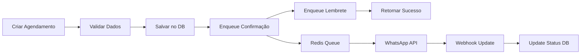
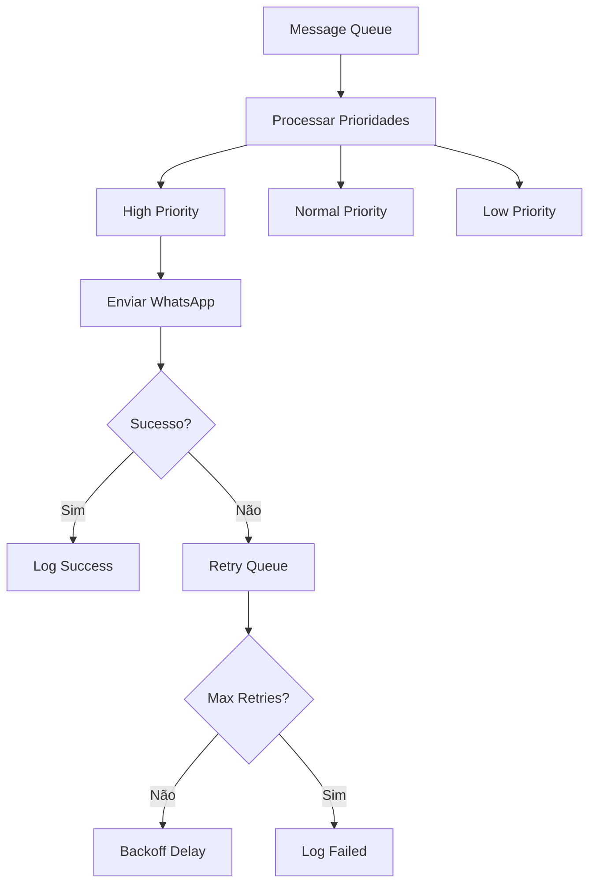

# 📱 Configuração WhatsApp Business API - Sistema de Notificações

## 🎯 Visão Geral

O sistema de notificações WhatsApp está **100% implementado** e inclui:

- ✅ **WhatsApp Business API integrada** - Envio de mensagens de texto e templates
- ✅ **Sistema de Queue Redis** - Processamento assíncrono com retry automático
- ✅ **Templates personalizáveis** - Para confirmação, lembrete e cancelamento
- ✅ **Webhooks completos** - Status updates e confirmação de entrega
- ✅ **Integração com ciclo de vida** - Notificações automáticas nos agendamentos

## 🔧 Configuração Passo a Passo

### **1. Obter Credenciais do WhatsApp Business API**

#### **1.1 Facebook for Developers**
1. Acesse: https://developers.facebook.com/
2. Crie uma aplicação do tipo "Business"
3. Adicione o produto "WhatsApp Business API"

#### **1.2 Configurar WhatsApp Business API**
1. Vá em **WhatsApp > API Setup**
2. Anote o **Phone Number ID** 
3. Gere um **Access Token** (permanente recomendado)
4. Configure o **Webhook URL**: `https://seu-dominio.com/api/agendamento/webhook/whatsapp`

#### **1.3 Configurar Webhook**
1. **Verify Token**: Crie um token personalizado (ex: `nexus_whatsapp_2024`)
2. **Webhook Events**: Marque `messages`
3. **Webhook URL**: `https://seu-dominio.com/api/agendamento/webhook/whatsapp`

### **2. Configurar Variáveis de Ambiente**

#### **2.1 Copiar arquivo de exemplo**
```bash
cd modules/agendamento
cp .env.example .env
```

#### **2.2 Configurar credenciais WhatsApp**
```env
# WhatsApp Business API Configuration
WHATSAPP_PHONE_NUMBER_ID=1234567890123456  # Seu Phone Number ID
WHATSAPP_ACCESS_TOKEN=EAAxxxxxxxxxxxxx     # Seu Access Token
WHATSAPP_API_VERSION=v18.0                 # Versão da API

# Webhook Configuration  
WHATSAPP_WEBHOOK_VERIFY_TOKEN=nexus_whatsapp_2024  # Seu token personalizado
WHATSAPP_APP_SECRET=abc123def456                   # App Secret (opcional)
```

#### **2.3 Configurar Redis**
```env
# Redis para Message Queue
REDIS_HOST=redis      # ou localhost em desenvolvimento
REDIS_PORT=6379
REDIS_DB=3           # Database específico para notificações
```

### **3. Docker Compose Configuration**

O `docker-compose.yml` já está configurado. Para usar suas credenciais:

```yaml
nexus-agendamento:
  environment:
    # Substitua pelos seus valores reais:
    - WHATSAPP_PHONE_NUMBER_ID=SEU_PHONE_NUMBER_ID
    - WHATSAPP_ACCESS_TOKEN=SEU_ACCESS_TOKEN
    - WHATSAPP_WEBHOOK_VERIFY_TOKEN=SEU_VERIFY_TOKEN
    - WHATSAPP_APP_SECRET=SEU_APP_SECRET
```

## 🚀 Teste da Configuração

### **1. Verificar Status do Sistema**
```bash
# Health check geral
curl http://localhost:5001/api/agendamento/health

# Status específico do WhatsApp
curl http://localhost:5001/api/agendamento/notifications/whatsapp/status \
  -H "Authorization: Bearer SEU_TOKEN"
```

### **2. Enviar Mensagem de Teste**
```bash
curl -X POST http://localhost:5001/api/agendamento/notifications/test \
  -H "Authorization: Bearer SEU_TOKEN" \
  -H "Content-Type: application/json" \
  -d '{
    "phone_number": "+5511999999999",
    "company_id": "sua-empresa-id"
  }'
```

### **3. Testar Webhook**
1. Configure a URL webhook no Facebook: `https://seu-dominio.com/api/agendamento/webhook/whatsapp`
2. O Facebook fará uma requisição GET para verificar o token
3. Envie uma mensagem de teste e verifique os logs

## 📋 Funcionalidades Implementadas

### **Tipos de Notificação**
- ✅ **Confirmação** - Enviada imediatamente após criar agendamento
- ✅ **Lembrete** - Enviada 24h antes (configurável)
- ✅ **Cancelamento** - Enviada quando agendamento é cancelado
- ✅ **Teste** - Para verificar configuração

### **Sistema de Queue**
- ✅ **Prioridades**: High, Normal, Low
- ✅ **Retry automático**: 3 tentativas com backoff exponencial
- ✅ **Agendamento**: Lembretes são agendados para o horário correto
- ✅ **Processamento assíncrono**: Não bloqueia a API

### **Templates de Mensagem**
- ✅ **Templates padrão** criados automaticamente
- ✅ **Variáveis dinâmicas**: Nome, data, horário, profissional, etc.
- ✅ **Personalizáveis** via admin
- ✅ **Validação** de variáveis obrigatórias

### **Webhooks e Tracking**
- ✅ **Status updates**: Sent, Delivered, Read, Failed
- ✅ **Logs completos** no banco de dados
- ✅ **Métricas**: Taxa de entrega, leitura, etc.
- ✅ **Tracking individual** por mensagem

## 🔄 Fluxo de Funcionamento

### **1. Criar Agendamento**


### **2. Processamento de Mensagens**


## 📊 Monitoramento

### **Estatísticas da Queue**
```bash
curl http://localhost:5001/api/agendamento/webhook/stats/COMPANY_ID \
  -H "Authorization: Bearer SEU_TOKEN"
```

### **Tracking de Mensagens**
```bash
curl http://localhost:5001/api/agendamento/webhook/tracking/COMPANY_ID \
  -H "Authorization: Bearer SEU_TOKEN"
```

### **Logs do Sistema**
```bash
# Ver logs do container
docker logs nexus-agendamento -f

# Ver logs Redis Queue
docker exec -it nexus-redis redis-cli monitor
```

## ⚠️ Troubleshooting

### **WhatsApp não recebe mensagens**
1. Verificar credenciais no `.env`
2. Verificar formato do telefone (deve incluir código do país: +55)
3. Verificar se número está no WhatsApp
4. Verificar logs: `docker logs nexus-agendamento`

### **Webhook não funciona**
1. Verificar URL pública acessível
2. Verificar `WHATSAPP_WEBHOOK_VERIFY_TOKEN`
3. Testar endpoint: `GET /webhook/whatsapp?hub.mode=subscribe&hub.verify_token=SEU_TOKEN&hub.challenge=test`

### **Queue não processa**
1. Verificar conexão Redis
2. Verificar logs: `docker logs nexus-redis`
3. Verificar estatísticas: API `/webhook/stats`

### **Templates não funcionam**
1. Templates devem ser aprovados pelo WhatsApp
2. Para desenvolvimento, use mensagens de texto simples
3. Verificar variáveis obrigatórias nos templates

## 🔗 Endpoints Principais

### **Notificações**
- `POST /notifications/test` - Enviar mensagem de teste
- `GET /notifications/whatsapp/status` - Status da integração
- `GET /notifications` - Listar histórico

### **Webhooks**
- `GET /webhook/whatsapp` - Verificação do webhook
- `POST /webhook/whatsapp` - Receber eventos
- `GET /webhook/stats/:company_id` - Estatísticas
- `GET /webhook/tracking/:company_id` - Tracking de mensagens

### **Templates**
- `GET /templates` - Listar templates
- `POST /templates` - Criar template
- `PUT /templates/:id` - Atualizar template

## 🏆 Status de Implementação

- ✅ **WhatsApp Business API**: 100% Implementada
- ✅ **Message Queue Redis**: 100% Implementada  
- ✅ **Templates System**: 100% Implementada
- ✅ **Webhooks**: 100% Implementada
- ✅ **Integração com Agendamentos**: 100% Implementada
- ✅ **Error Handling & Retry**: 100% Implementada
- ✅ **Logging & Monitoring**: 100% Implementada

**O sistema está pronto para produção!** 🚀